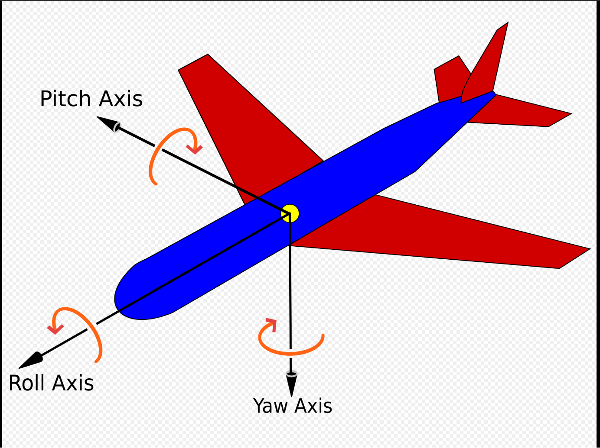

## 🧭 Unity vs Unreal 坐标系区别

| 引擎                   | 前进方向     | 上方向      | 左右手系      |
| -------------------- | -------- | -------- | --------- |
| **Unity**            | **Z+ 前** | **Y+ 上** | **左手坐标系** |
| **Unreal (UE4/UE5)** | **X+ 前** | **Z+ 上** | **右手坐标系** |

### 🔹 直观理解

- 在 **Unity** 里，角色默认面朝 **Z 正方向**，地面是 **X-Z 平面**。

- 在 **Unreal** 里，角色默认面朝 **X 正方向**，地面是 **X-Y 平面**。

所以：

- 如果你从 Unity 模型导入到 Unreal，经常会发现模型转了 90°，就是因为 **前向轴不一样**。

## 🎛 Roll / Pitch / Yaw（欧拉角）

这是三维旋转的三轴定义，不同引擎命名一致，但参考轴不同：

- **Roll（横滚）**  
  围绕 **前进轴（Forward）** 旋转。  
  类似飞机“左右翻滚”。

- **Pitch（俯仰）**  
  围绕 **右轴（Right）** 旋转。  
  类似飞机“机头抬起或压下”。

- **Yaw（偏航）**  
  围绕 **上轴（Up）** 旋转。  
  类似飞机“左右转头”。

### 举例：

在 **Unreal（X 前，Z 上）**：

- **Yaw** → 绕 Z 轴转，控制朝向左右。

- **Pitch** → 绕 Y 轴转，控制上下俯仰。

- **Roll** → 绕 X 轴转，控制左右倾斜。

在 **Unity（Z 前，Y 上）**：

- **Yaw** → 绕 Y 轴转。

- **Pitch** → 绕 X 轴转。

- **Roll** → 绕 Z 轴转。

也就是说，名字相同，但由于坐标系定义不同，实际的轴向要换算。

---

## 🔑 总结

- **Unity**：左手系，Z 前，Y 上。

- **Unreal**：右手系，X 前，Z 上。

- **Roll/Pitch/Yaw**：分别对应绕前进、右、上轴的旋转，但轴的实际方向取决于引擎坐标系。

四元数  Quaternion

作为用于描述现实空间的坐标表示方式，人们在复数的基础上创造了四元数并以a+bi+cj+dk的形式说明空间点所在位置。 i、j、k作为一种特殊的虚数单位参与运算，并有以下运算规则：i0=j0=k0=1，i2=j2=k2=-1

欧拉角
