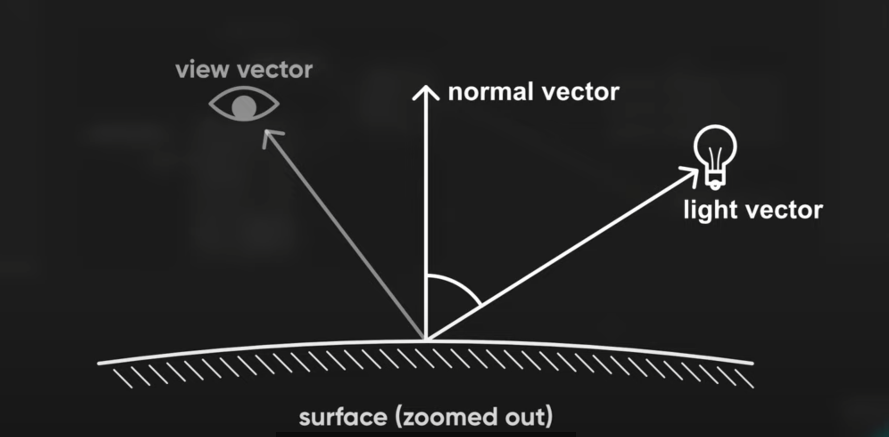
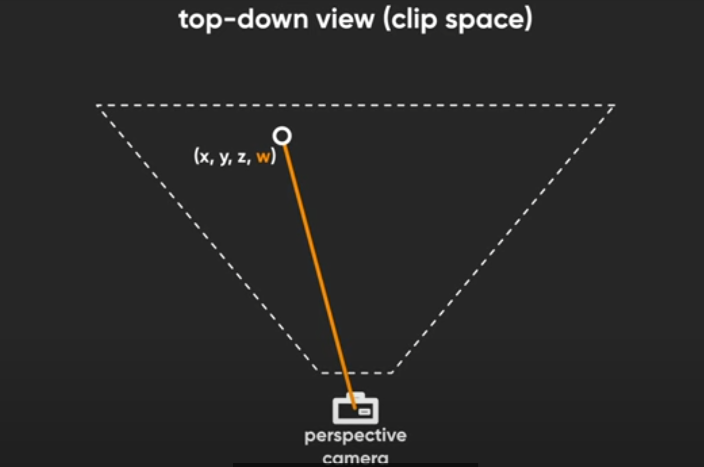
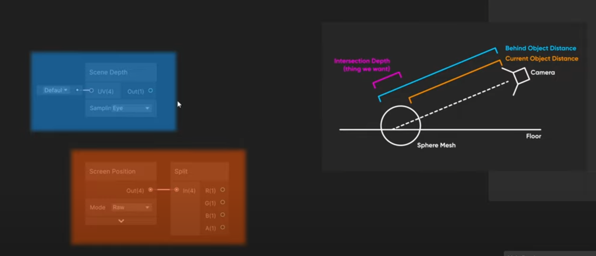
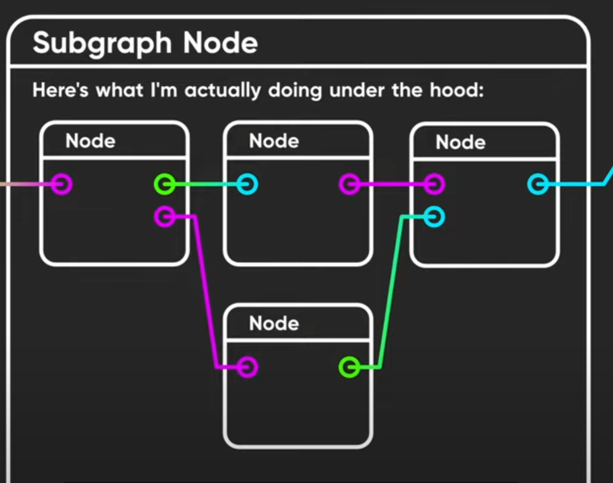

C# 第五章 编写异步代码

# 5.0开头

异步编程：可以解决线程因为等待独占式任务而导致的阻塞问题，正确实现异步编程是一个难题。

### (TODO， 周末了解)

了解：

.NET 1.x  BeginFoo/EndFoo模型 使用IAsyncResult, AsyncCallback 

.NET 2.0 事件驱动异步模型，通过BackgroundWorker和 WebClient实现

.NET 4.0 任务并行库（TPL）, .NET 4.5扩展

C# 5 推出 async/await。特性基于 任务并行库, 开发者可以用形如同步变成的方式来编写异步代码。告别了繁琐的回调，订阅和碎片化的错误处理（why ?)

C# 6, 7 对上述特性进行了改进

await语法和普通阻塞很像----当前操作完成前，后续代码不执行。但await不阻塞当前线程。

## 5.1 异步函数简介

C# 5 引入了**异步函数**的概念。异步函数可以指某个由async修饰的方法或匿名函数，它可以对await表达式使用await运算符

(匿名函数指 lambda表达式或匿名方法)

await表达式： 如果await表达式所做的操作未完成，异步函数立即返回，当表达式的值可用后，代码将从之前的位置（恰当的线程）中恢复执行。

### （TODO）了解

HttpClient是WebClient的改进版， 优先选择 .NET 4.5之后的HTTP API，只包含异步模式的操作。

await 的主要作用是 避免在等待长耗时操作时，线程被阻塞。

执行到await时，如果还没有得到执行结果。会创建一个续延(continuation),当得到结果，执行该continuation

continuation : 本质上是回调函数，当异步操作（任务）执行完成后被调起

在async方法中，continuation负责维护方法的状态，类似于闭包维护变量的上下文(?)   Task类有一个专门用于附加continuation的方法: Task.ContinueWith

## 5.2 异步模式的思考(more to add)

虽然多线程是异步模式的经典用途之一，但不是异步执行的必要条件。

C#5 的异步方法典型流程

1. 执行某操作

2. 启动异步操作， 记录其返回令牌

3. 执行其他操作（通常为空， 因为完成前不能进行后续操作）

4. （利用令牌）等待异步操作完成

5. 执行其他操作

6. 完成执行

## 5.3 async方法声明

生成的IL中，async修饰符被省略了，因为对于调用方法来说，只是恰好返回值是task的普通方法

返回值类型void, Task, Task<TResult>

方法参数不能由out, ref 修饰。因为out, ref用于于调用方交互信息，有时async方法在控制流返回调用方时，操作可能还未开始执行。

# Shader

### Custom Lighting

ambient(环境光）, diffuse（漫射照明） specular(镜面反射)

Fresnel 菲涅尔？外圈一圈  强度越大 外圈越大

用于圆形，弯曲的物体

HDR   high dynamic Range

Intensity 强度

每个其实就是RGB  乘于    intensity的次方    强度是 0 

NPR   non-photorealistic

漫射光

Diffuse light = n dot I



节点： MainLight Direction (从光源原点指向表面, 取反(negate)

与normal vector(法线向量) 点乘

处理细胞外观

两个方法:

1. Step节点 两个输入In, Edge 
   
   本质上，如果In 输入低于Edge输入， 输出0 或黑色，否则1，即白色

2. SmoothStep 

多了一个bufferzone 平滑

### Bonues: OpernGL

https://learnopengl-cn.github.io/

https://learnopengl-cn.readthedocs.io/zh/latest/https://learnopengl-cn.readthedocs.io/zh/latest/

图形学 线性代数，几何，三角学。

OpenGL

被认为是一个API，包含了一系列可以操作图形、图像的函数，然而本身不是一个API是由Khronons组织制定并维护的规范(Specification)

早期使用 立即渲染模式(Immediate mode 也就是固定渲染管线)

从 OpenGL3.2开始， Core-profile (核心模式)

OpenGL 本身是一个巨大的状态机： 一系列的变量描述OpenGL此刻应当如何运行。 OpenGL的状态通常被称为OpenGL上下文(Context)

通过以下途径去更改状态: 设置选项，操作缓冲,最后用context来渲染

# 

# 9.11

## Await表达式

await表达式：  await运算符外加一个可以返回值的表达式即可

搭配的表达式必须是可等待的

5.4.1 可等待模式

用于判断哪些类型可以使用await运算符， 是异步操作的定义基础。

不是基于接口来表达的，实际上是基于模式实现。 比如使用using表达式，必须实现IDisposable。

假如有一个返回类型为T的表达式要用await

编译器检查步骤如下

1. T必须具备一个无参数的GetAwaiter()实例方法，或者存在T的扩展方法。该方法以类型T作为唯一参数。GetAwaiter方法的返回类型不能是void，返回类型成为awaiter类型

2. awaiter类型必须实现System.Runtime.INotifyCompletion接口，接口只有一个方法 void OnCompleted(Action)

3. awaiter类型必须具有一个可读的实例属性IsCompleted，类型为bool

4. 必须具有一个非泛型、无参数的实力方法 GetResult

5. 成员不必为public 但需要被调用await的async方法访问到。

编译器通过GetResult获得await表达式的类型，如果是void 则视为无结果表达式，否则与GetResult保持一致

5.4.2 await表达式的限制条件

不能用于非安全的上下文中(unsafe)

锁中不能用await

如果有特殊：在锁中等待某个异步操作，最好重新设计，非常特殊：SemaphoreSlim的WaitAsync方法

lock语句中用的monitor只能由请求它的同一线程来释放

C#5中禁用 但C#6解禁了

1. 所有带有catch的try块

2. 所有catch块

3. 所有finally块

## Shader

Scene Intersections 场景交叉

foam 泡沫

occlusion 阻塞 遮挡

交叉shader必须是透明的

Unity在渲染完所有不透明物理后，在渲染透明物体前，才将之前的depth-buffer状态保存到深度纹理中。

TODO ?

Scene Depth Difference Node

Scene Depth Node  获得节点到摄像机和之前在此像素渲染的任何对象之间的距离

 （Eye Mode 获得精确距离）

Clip Space

 Mesh相对于相机的表示，包含了近和远的ClipSpace和 视场(?)，一切都在相机的可见边界框内或外，ClipSpace 正如名字，可以让Unity轻松的裁剪（删除）不可见的对象 

然后Unity通过ClipSpace到ScreenSpace  计算摄像的视角（顶点阶段后）

Clip Space 用4D向量表示3D位置

w = 相机到正在渲染的顶点之间的距离





子图， 复用一些操作



# 9.11

## 5.5 返回值的封装

返回非泛型的Task和普通void方法没有区别

自动封装和拆封的组合，成就了异步特性的组合模式。async方法可以轻松消费其他async方法的结果，所以可以用多个异步小结构构建一个复杂的系统。可以参照LINQ： 在LINQ中，针对序列中的单个元素编写操作，然后通过封装和拆封把操作应用于整个序列。

### 5.6 异步方法执行流程

对async/await理解的几个层次

1. 不求甚解，只希望于await能顺利执行

2. 研究代码的执行方式：哪个线程什么事件发生了什么操作，但不清楚背后的实现原理

3. 深入探究整个基础架构并了解运行原理

重要的是：当需要深入思考时，由相关的知识储备。

5.6.1 await的操作对象与时机

```
string pageText = await new HttpClient().GetStringAsync(url)
// 等价于

Task<string> task = new HttpClient().GetStringAsync(url);
string pageText = await task;
```

### 5.6.2 await表达式的运算

执行到await时，有两种可能： 异步操作已完成或尚未完成。如果操作完成，执行流程继续即可。完成有两种情况：如果操作失败并捕获了表示失败的异常，抛出异常；如果执行成功，那么获取，获取操作结果（比如Task<string>里的string)

描述异步行为时    方法返回（返回到原调用方法或某个续延）   异步方法可以多次返回

当async方法await延迟task时 会马上返回。
