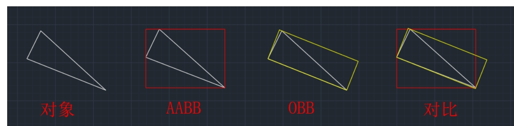

# AI

## Game Algorithm

Boids 算法

Boids（鸟群算法）是 Craig Reynolds 在 1986 年提出的一个仿生学算法，用来模拟鸟群、鱼群等群体生物的自然运动。它的核心思想是：群体的整体复杂行为，不是由中心控制产生的，而是由每个个体遵循一些 简单的局部规则 形成的。

每个个体有三条基本规则:1. 分离(Separation), 2.  对齐(Alignment), 3.  凝聚(Cohesion).
离太近会分开, 看大家往哪飞 同步调整, 尽量往群体中心飞 不掉队

AABB算法 (Axis-Aligned Bounding Box)

OBB 算法 ( Oriented Bounding Box )

A*算法   启发式

f(n) = g(n) + h(n)

g(n) 实际代价（已经走过的路）

h(n) 启发代价（预估剩余的路）

f(n) 综合优先级

通过不断的压入节点 通过知道 gn hn  得到最后的 fn

然后不断的弹出最小的fn

Dijk 只看走过的路  （广度优先） 会探索许多节点位置

 