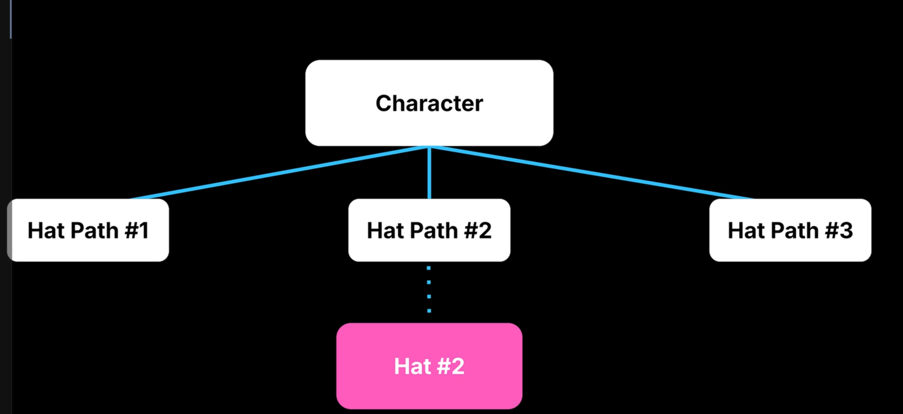

# QuickGuide

# Note

# Concept

GC

Mark And Sweep Stage (UObject创建的)

继承自UOjbect  (A或U开头的 )  AActor APawn UWorld...

标记可达对象和不可达对象的过程叫reachabiliyt analysis(可达性分析)

几条原则

1. UObject必须通过专门的函数进行分配 NewObject / CreateDefaultSubobject
2. 不能用new

保持UObject 需要将一个指针成员声明为UPROPERTRY （是一个重要组成部分， 提供了基础反射数据， 知道要检查who)

还有一个 模板指针类 TObjectPtr (?)额外编辑器

部分容器支持(TArray TSet TMap)

C++ 标准智能指针 （TUniquePtr， TSharedPtr, TWeakPtr)不能和UObject一起用

例子：游戏中换帽子(TSoftObjectPtr)

只加载资产的路径， 需要的时候再去加载

实际销毁  非Actor的UObjecet调用 可以使用 ConditionalBeginDestory()

Actor->Destroy()

优化：

1. profilling 分析  LogGarbage  Unreal Insights

2. GC clustering 垃圾回收群集化      敌人和武器 这是一组Cluster

3. DisregardForGC 永久存在的 不删除的对象

4. 最直接就是少点UObject       Macros的产生的UObject比蓝图函数多

5. Smart Point

6. 链接 https://www.bilibili.com/video/BV1VDEnzyEKh/

# API
