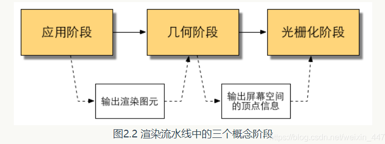

# Shader 入门摘要

Shader: 着色器

## 什么是渲染流水线

从一系列顶点数据、纹理等信息出发，把这些信息最终转换成一张人眼可以看到的图像。通常由CPU和GPU共同完成的。

渲染流程(Real-Time Redering, Third Edition)中分成3个阶段:应用阶段(Application Stage), 几何阶段(Geometry Stage), 光栅化阶段(Rasterizer Stage).

### 应用阶段

    由应用主导，通常由CPU负责实现。

    应用中，开发者有3个主要任务：

首先，准备**场景数据**，例如摄像机的位置、场景中包含哪些模型，使用了哪些光源等等。

其次，为了提高渲染性能，**粗粒度剔除**(culling)

最后，设置每个模型的渲染状态，包括但不限于它使用的材质(漫反射颜色)、使用的纹理、使用的Shader等。主要的是渲染所需的几何信息，即**渲染图元**(rendering primitives)

