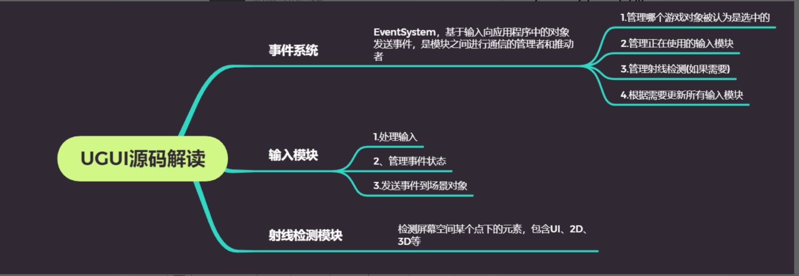
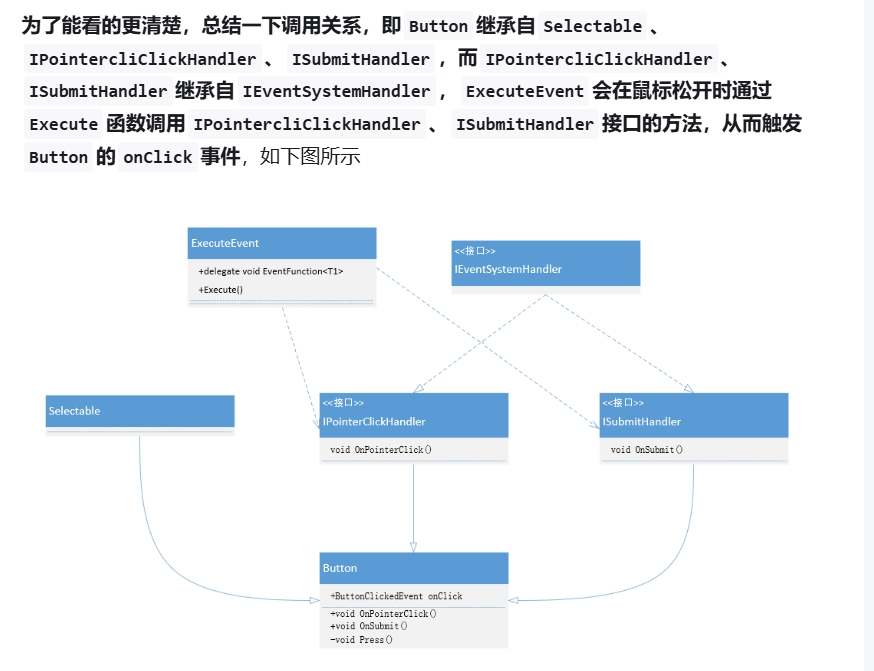
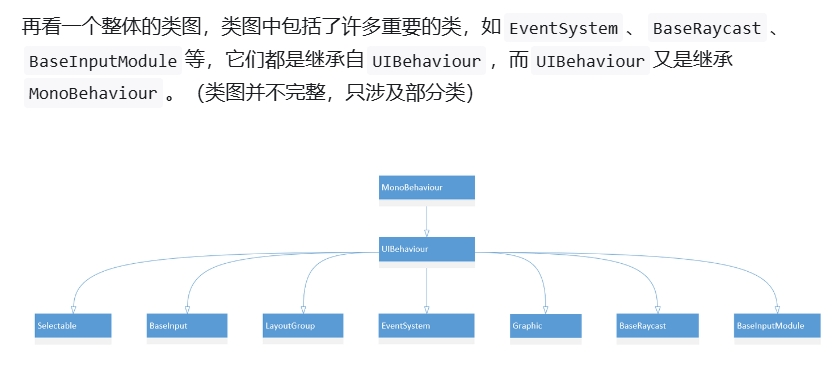

https://zhuanlan.zhihu.com/p/437704772


Quick Resee




Button集成自 Selectable, IPointerClickHander, ISubmitHandler

前者是鼠标点击, 后者在点击提交按钮时会调用回调


```text
[Serializable]
     //定义一个点击事件
     public class ButtonClickedEvent : UnityEvent {}
​
     // 实例化一个ButtonClickedEvent的事件
     [FormerlySerializedAs("onClick")]
     [SerializeField]
     private ButtonClickedEvent m_OnClick = new();

//常用的onClick.AddListener()就是监听这个事件
     public ButtonClickedEvent onClick
     {
         get { return m_OnClick; }
         set { m_OnClick = value; }
     }
```








### **`EventSystem`类**

事件系统主要是**基于输入(键盘、鼠标、触摸或自定义输入)向应用程序中的对象发送事件**，当然这需要其他组件的配合。当你在`GameObject`中添加`EventSystem`时，你会发现它并没有太多的功能，这是因为**`EventSystem`本身被设计成事件系统不同模块之间通信的管理者和推动者**，它主要包含以下功能：

- **管理哪个游戏对象被认为是选中的**
- **管理正在使用的输入模块**
- **管理射线检测(如果需要)**
- **根据需要更新所有输入模块**


简单概括一下`UML`图的含义，比如实线+三角形表示继承，实线+箭头表示关联，虚线+箭头表示依赖，关联和依赖的区别主要是引用其他类作为成员变量代表的是关联关系，将其他类作为局部变量、方法参数，或者引用它的静态方法，就属于依赖关系。


### **`InputModules`**

输入模块是配置和定制事件系统主逻辑的地方。 自带的输入模块有两个，一个是为独立输入(`StandaloneInputModule`)，另一个是为触摸输入(`TouchInputModule`)。 `StandaloneInputModule`是`PC`、`Mac&Linux`上的具体实现，而`TouchInputModule`是`IOS`、`Android`等移动平台上的具体实现，每个模块都按照给定配置接收和分派事件。 运行`EventSystem`后，它会查看附加了哪些输入模块，并将事件传递给特定的模块。 内置的输入模块旨在支持常见的游戏配置，如触摸输入、控制器输入、键盘输入和鼠标输入等。

它的主要任务有三个，分别是

- **处理输入**
- **管理事件状态**
- **发送事件到场景对象**


### **`Raycasters`**

事件系统需要一个方法来检测当前输入事件需要发送到哪里，这是由`Raycasters`提供的。 给定一个屏幕空间位置，它们将收集所有潜在目标，找出它们是否在给定位置下，然后返回离屏幕最近的对象。 系统提供了以下几种类型的`Raycaster`:

- **`Graphic Raycaster：` 检测`UI`元素**
- **`Physics 2D Raycaster：` 用于`2D`物理元素**
- **`Physics Raycaster：` 用于`3D`物理元素**


### `GraphicRaycast`

**`GraphicRaycast`用于检测`UI`元素，它依赖于`Canvas`，我们在场景中添加`Canvas`默认都会包含一个`GraphicRaycast`组件。它先获取鼠标坐标，将其转换为`Camera`的视角坐标，然后分情况计算射线的距离（`hitDistance`），调用`Graphic`的`Raycast`方法来获取鼠标点下方的元素，最后将满足条件的结果添加到`resultAppendList`中。**


