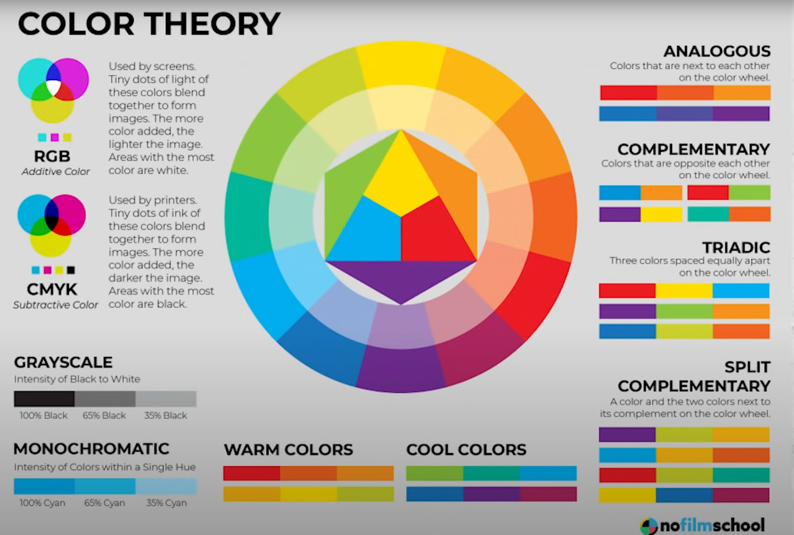
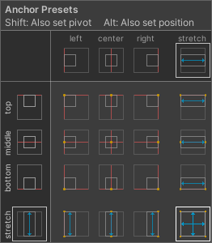
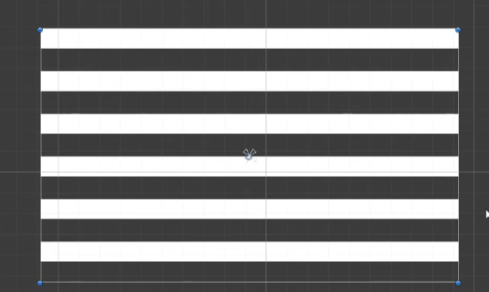
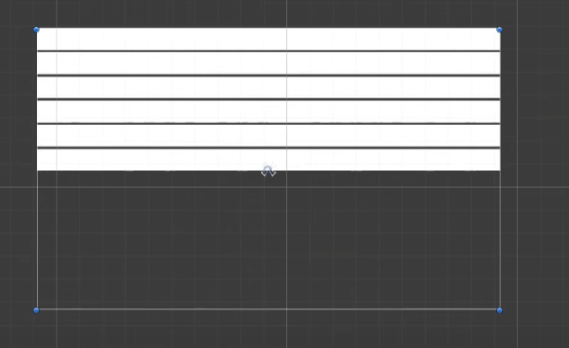
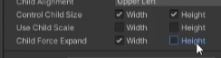

# Ui

[Making UI That Looks Good In Unity - YouTube](https://www.youtube.com/watch?v=HwdweCX5aMI&list=PLmHVaPHNtAjnKhemhlwB_-Q1CXYs40pqH&index=7)

## Two Main UI Design Approaches

FLAT (NON- Diagetic)    // 剧情的

Diagetic

Non-Diagetic is easier to get "right"

### Start:

Always Start with a COLOR PALETTE  // 调色板

 

[Understanding Color - YouTube](https://www.youtube.com/watch?v=Qj1FK8n7WgY)

学习如何懂得颜色的搭配(What is Good What is Bad)

选择Color

https://coolors.co/color-picker

https://flatuicolors.com

Shift + Alt ? Why ?

// nested 嵌套的

Content Size Fitter

Horizontal Layout Group

Vertical Layout Group

Layout Element

## Vertical Layout Group

### Child Force Expand

Height => 勾选后会在框架内，自动填充排序（

不勾选 就按间隔数直接排序

### Control Child Size

Height 不勾选 => Use layout element to control size

会导致UI消失

需要添加Layout Element指定最小大小等

### Layout Element

子对象添加Layout Element 设置最小Height、Weigtht等。

LayoutGroup会优先填充min Size of Childrens First.Then distrubute(分配) remaining space to layout elements flagged with "preferred"

// Blur 模糊

Concept :    Gaussian Blur ?
