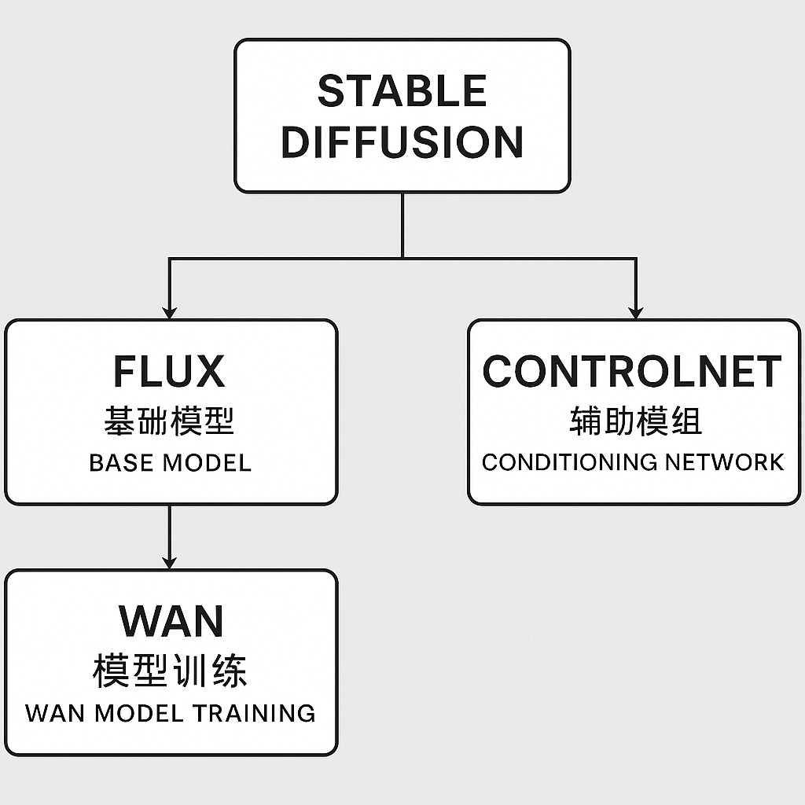
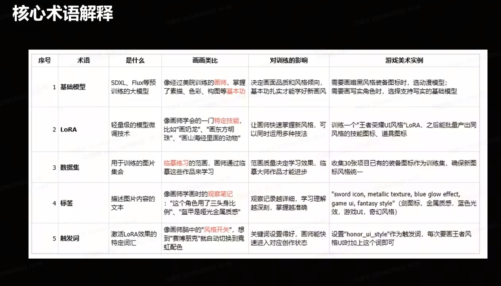

SD. FLUX, ControlNet  Wan ? 是啥

1. ## 1. **FLUX**
   
   - **是什么**  
     FLUX 是 **一种新型的 Stable Diffusion 模型架构**（比如 `FLUX.1 [dev]`、`FLUX.1 [pro]` 等），由 Black Forest Labs 开发。  
     它不是传统 SD 1.5 或 SDXL 的简单升级，而是采用了更高效的 **Transformer 架构**（而不是 UNet 为主）来生成图片。
     
     - 支持更高的细节保真度
     
     - 更好理解复杂提示词
     
     - 更强的构图控制
   
   - **用途**
     
     - 比老的 SDXL 更擅长生成高质量、结构稳定的图片
     
     - 支持相对更灵活的分辨率
     
     - 与 ControlNet、LoRA、IP-Adapter 等配合使用时，效果会更稳定
   
   > 简单理解：FLUX 是一种 **新底座模型**，类似从“引擎 2.0”换到“引擎 3.0”。
   
   ---
   
   ## 2. **ControlNet**
   
   - **是什么**  
     ControlNet 是 Stable Diffusion 的 **扩展模块**，允许你在生成图片时添加 **额外的结构/姿势/轮廓等条件**。  
     它会在模型内部增加一条“控制分支”，接收辅助输入（如线稿、深度图、姿态骨骼等），并与原模型融合，从而让 AI 更精确地跟随你提供的参考图。
   
   - **常见用途**
     
     - **Canny 边缘**：让生成图片的轮廓严格跟随输入图
     
     - **Pose / OpenPose**：生成指定姿势的人物
     
     - **Depth / Normal**：保持三维结构一致
     
     - **Scribble**：用随手涂鸦的形状生成图像
   
   - **特点**
     
     - 可和任意底座（SD1.5、SDXL、FLUX 等）配合
     
     - 用于“精准复刻”构图、姿势、布局
   
   > 简单理解：ControlNet 就像“方向盘”，你给它一张骨架/轮廓图，它让 AI 在这个框架内发挥。
   
   ---
   
   ## 3. **WAN 模型训练**
   
   - **是什么**  
     “WAN” 在 AI 绘图圈子里多指 **WAN 模型（WAN-Diffusion）**，是一个针对 **二次元 / 漫画风格** 优化的 Stable Diffusion 模型家族，主要由中文社区（尤其是哇凹娘 WAN 社区）训练并发布。
   
   - **用途**
     
     - 专注动漫、插画、日系风格
     
     - 对头发丝、服装褶皱、漫画线条表现更好
     
     - 常与 LoRA 配合，用于同人、游戏立绘、漫画分镜
   
   - **WAN 模型训练** 就是把已有的底座（如 SD1.5、SDXL）用大规模动漫数据集微调，得到适合二次元风格的模型。
     
     - 可能会用 **DreamBooth**、**LoRA**、**Fine-tune** 等训练方式
     
     - 也有 WAN 风格 LoRA 单独加载
   
   > 简单理解：WAN 是“动漫专用底座模型”，WAN 模型训练就是让模型更懂二次元的样子。
   
   ---
   
   ## 总结对比
   
   | 名称             | 角色          | 类别   | 用途              |
   | -------------- | ----------- | ---- | --------------- |
   | **FLUX**       | 新一代 AI 绘图底座 | 基础模型 | 更高画质、更强理解、灵活分辨率 |
   | **ControlNet** | 精准构图控制      | 辅助模块 | 用参考图控制 AI 画面结构  |
   | **WAN 模型训练**   | 动漫风格优化      | 微调模型 | 专攻二次元/插画的生成     |
   
   ---
   
   如果你是做**二次元风格**，WAN 会是首选；  
   如果你要**更高质量写实/全能绘制**，FLUX 更合适；  
   如果你需要**精确复刻姿势或布局**，就一定要用 ControlNet。

Words

模型训练的流程

1. 准备训练集  

2. 数据打标

3. 参数调整 (多大, 训练多久etc)

4. 模型测试

1张图 + 视频编辑 (360°)  然后各种姿态衣服etc Ai再生成.  最后合起来去生成

SDXL 可以微调很多

FLUX 微调模型比较少, 而且效果不好
